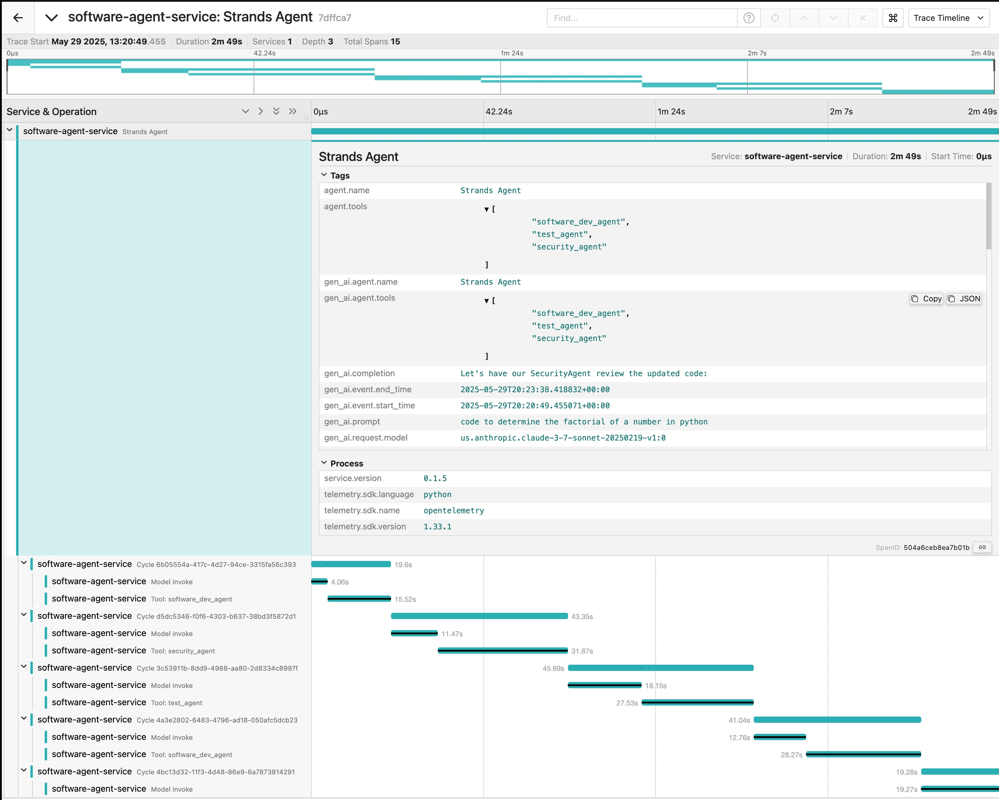

# Basic Examples for using Strands SDK

  

## Setting up Jaeger for agent traces 

Download and install [Jaeger](https://www.jaegertracing.io/) on your instance

Start the Jaeger daemon

  

Ensure that this code block is present in your python script. Update the `service_name` and `otlp_endpoint` values to reflect your setup.

```python
	os.environ["STRANDS_OTEL_ENABLE_CONSOLE_EXPORT"] = "false"
	tracer = get_tracer(
		service_name="my-agent-service",
		otlp_endpoint="http://localhost:4318",
	)
```

if you would like to see the agent traces on the console in addition to Jaeger, set `os.environ["STRANDS_OTEL_ENABLE_CONSOLE_EXPORT"] = "false"` to `true`
 
To view the traces of your execution navigate to http://localhost:16686/search on your browser.

The trace for an agentic flow can now be seen in Jaeger 



## Strands with MCP

First we create an MCP server that will host the tools required for our workflow. In this specific example, the MCP server host tools for weather look-ups for cities in the US

#### Settings the MCP Server 

The MCP server is available under weather/ directory [weather-http-server](https://github.com/shamikatamazon/mcp-samples/blob/main/weather/weather-http-server.py)

Install the dependencies for the server (fastmcp) and then run the command below

```bash
fastmcp  run  weather-http-server.py:mcp  --transport  sse  --port  8080  --host  0.0.0.0  --log-level  debug
```

Once the server is up and running, you should see the following message in the console 

```
INFO     Found server "weather" in .../weather-http-server.py                   
FastMCP.cli - INFO - Found server "weather" in ../weather-http-server.py
INFO     Starting server "weather"
FastMCP.fastmcp.server.server - INFO - Starting server "weather"...
INFO:     Started server process [41502]
INFO:     Waiting for application startup.
INFO:     Application startup complete.
INFO:     Uvicorn running on http://0.0.0.0:8080 (Press CTRL+C to quit)
```

In `agentWithMCP.py` ensure that the MCP client is configured to point to the port where the MCP server is exposed 
`sse_mcp_client  = MCPClient(lambda: sse_client("http://localhost:8080/sse"))`

In this case you can see that the server is running on port 8080, and the MCP client is connecting to the same 8080 port. 

Now, execute `agentWithMCP.py` 
